# 世界所有国家的国旗

ISO标准国家代码 https://www.wikiwand.com/zh-hans/ISO_3166-1
国旗图片来自 http://flagpedia.asia/

- flags.json [flags.json](../resources/flags/flags.json)

## 美国本土外小岛屿

## 南极洲

## 伊拉克

## 塞拉利昂

## 老挝

## 坦桑尼亚

## 阿尔及利亚
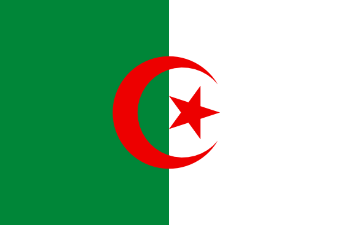

## 秘鲁

## 法属南方和南极洲领地

## 诺福克岛

## 古巴

## 孟加拉国

## 利比里亚

## 南乔治亚和南桑威奇群岛

## 萨尔瓦多

## 马提尼克

## 义大利

## 安道尔

## 墨西哥

## 安地卡及巴布达

## 蒙特内哥罗

## 科特迪瓦

## 加拿大

## 圣诞岛

## 密克罗尼西亚联邦

## 印尼

## 乍得

## 加彭

## 尼加拉瓜

## 斯威士兰

## 科科斯（基林）群岛

## 赛普勒斯

## 克罗地亚

## 叶门

## 匈牙利
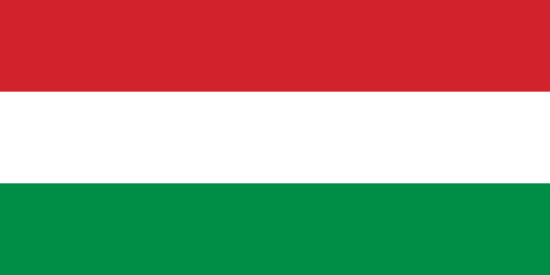

## 喀麦隆

## 波多黎各

## 马里

## 尼日尔

## 几内亚比绍

## 中非

## 直布罗陀

## 巴布亚新几内亚

## 伊朗
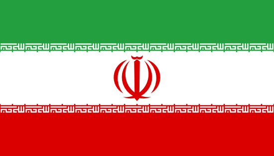

## 蒙特塞拉特

## 澳大利亚

## 洪都拉斯

## 阿曼
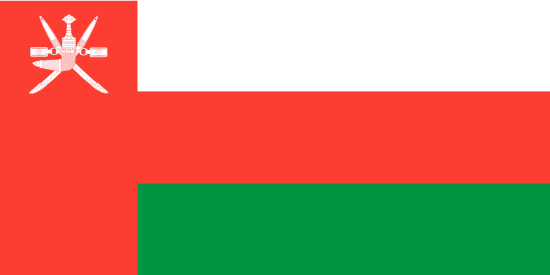

## 冈比亚

## 法属圭亚那

## 皮特凯恩群岛

## 爱尔兰

## 北马里亚纳群岛

## 圣皮埃尔和密克隆

## 贝宁

## 布隆迪

## 格陵兰

## 莫桑比克

## 委内瑞拉

## 加纳
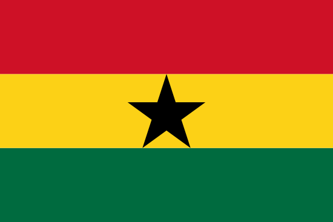

## 捷克

## 芬兰

## 瓜德罗普

## 卢旺达

## 斯洛维尼亚

## 亚美尼亚

## 瓦努阿图

## 美属维尔京群岛

## 千里达及托巴哥

## 索马利亚

## 库克群岛

## 巴勒斯坦

## 马来西亚

## 文莱

## 日本

## 苏丹

## 奈及利亚

## 安圭拉

## 圣文森特和格林纳丁斯

## 挪威

## 蒙古国

## 哈萨克斯坦
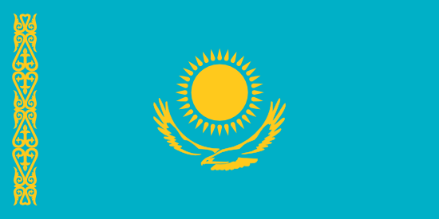

## 危地马拉

## 多哥

## 荷兰加勒比区

## 奥地利

## 冰岛

## 科威特

## 哥伦比亚

## 科摩罗

## 基里巴斯

## 多米尼克

## 叙利亚

## 柬埔寨
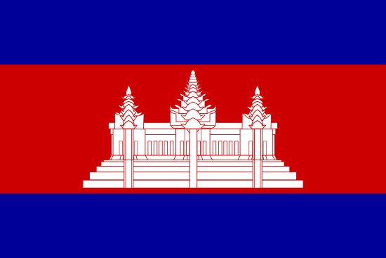

## 泽西

## 圣卢西亚

## 马达加斯加

## 巴拉圭

## 比利时

## 罗马尼亚

## 赫德岛和麦克唐纳群岛

## 伯利兹
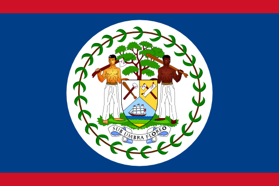

## 汤加

## 纽埃

## 阿尔巴尼亚

## 泰国

## 缅甸

## 尼泊尔

## 阿塞拜疆

## 荷兰

## 布吉纳法索

## 法国

## 希腊

## 以色列

## 刚果（布）

## 巴哈马

## 圣马丁

## 圭亚那

## 衣索比亚

## 瑞典

## 印度

## 斐济

## 新喀里多尼亚

## 卡塔尔

## 否

## 图瓦卢

## 瑞士

## 列支敦斯登
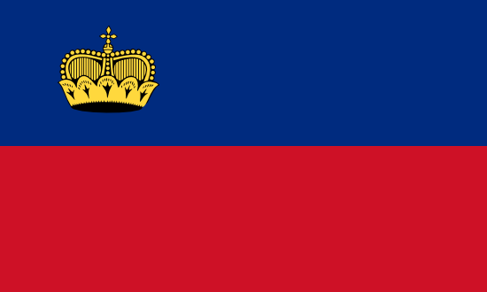

## 塞舌尔

## 留尼汪

## 刚果（金）

## 西班牙

## 乌干达

## 法属圣马丁

## 保加利亚

## 几内亚
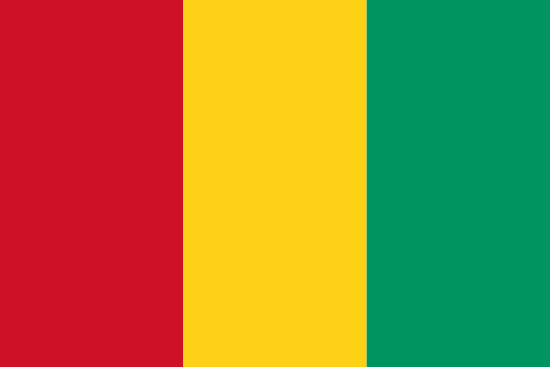

## 智利

## 赤道几内亚

## 美属萨摩亚

## 玻利维亚

## 瓦利斯和富图纳

## 格鲁吉亚

## 阿根廷

## 德国

## 波兰

## 塔吉克斯坦

## 乌拉圭
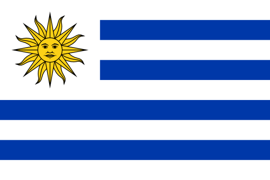

## 拉脱维亚

## 韩国

## 哥斯达黎加

## 卢森堡

## 约旦

## 阿富汗

## 百慕大

## 香港

## 立陶宛

## 厄立特里亚

## 黎巴嫩

## 阿鲁巴

## 所罗门群岛
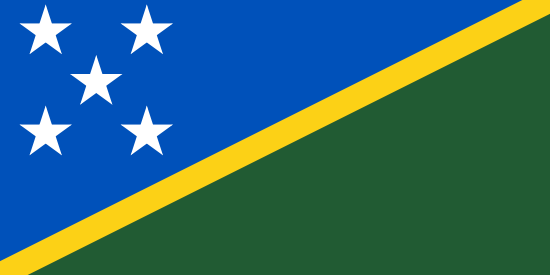

## 埃及

## 圣巴泰勒米

## 博茨瓦纳

## 萨摩亚

## 吉尔吉斯斯坦
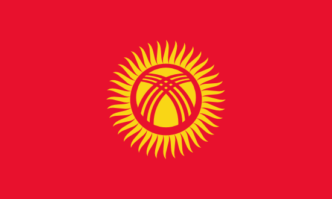

## 多米尼加

## 塞内加尔

## 海地
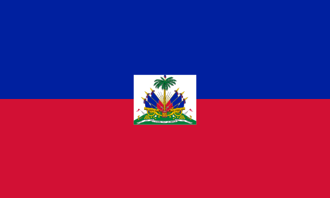

## 突尼西亚

## 斯里兰卡

## 模里西斯

## 美国

## 利比亚

## 巴拿马

## 马尔他

## 葡萄牙

## 苏里南
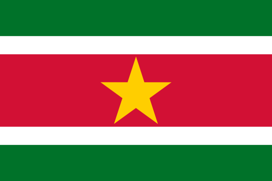

## 乌克兰

## 福克兰群岛

## 尚比亚

## 摩尔多瓦

## 法属玻里尼西亚

## 佛得角

## 奥兰

## 特克斯和凯科斯群岛

## 库拉索

## 阿联酋

## 摩纳哥

## 斯瓦尔巴和扬马延

## 爱沙尼亚

## 沙乌地阿拉伯

## 北马其顿

## 托克劳

## 圣多美和普林西比

## 圣基茨和尼维斯

## 法罗群岛

## 巴西

## 丹麦

## 牙买加

## 赖索托

## 摩洛哥

## 马绍尔群岛

## 朝鲜

## 英属印度洋领地

## 毛里塔尼亚

## 巴基斯坦

## 新加坡

## 西撒哈拉

## 布韦岛

## 新西兰

## 巴林

## 不丹

## 英国

## 圣马力诺

## 开曼群岛

## 梵蒂冈

## 英属维尔京群岛

## 辛巴威

## 马拉维

## 马尔地夫

## 马恩岛

## 土库曼斯坦

## 澳门

## 肯尼亚

## 斯洛伐克

## 东帝汶

## 塞尔维亚
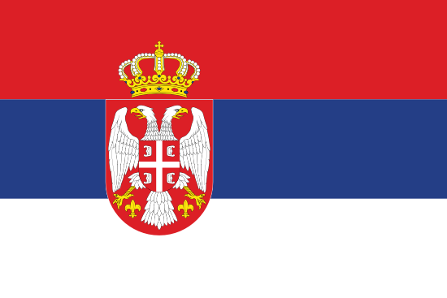

## 关岛

## 巴巴多斯

## 中国

## 越南

## 南非

## 吉布提

## 帛琉

## 俄罗斯

## 马约特

## 格瑞那达

## 瑙鲁

## 根西

## 菲律宾

## 乌兹别克斯坦

## 安哥拉
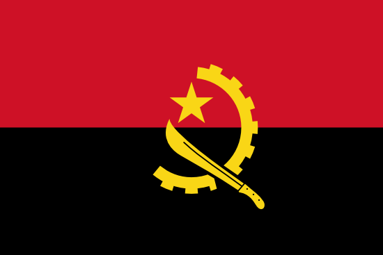

## 波斯尼亚和黑塞哥维那

## 南苏丹

## 圣赫勒拿、阿森松和特里斯坦-达库尼亚

## 纳米比亚

## 厄瓜多尔

## 白俄罗斯

## 土耳其

